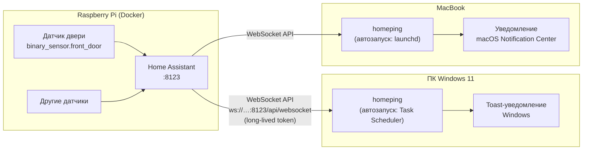
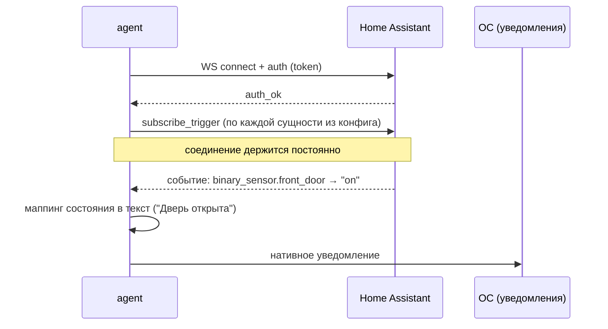

<!-- Этот документ описывает архитектуру решения: компоненты, потоки данных, безопасность, отказоустойчивость и границы системы. -->

# Архитектура решения

## 1. Задача

Датчики (открытие/закрытие двери и др.) подключены к Home Assistant, который работает в Docker на Raspberry Pi в локальной Wi-Fi-сети. Требуется доставлять изменения состояния датчиков на ПК с Windows 11 и MacBook в виде **нативных системных уведомлений** — мгновенно, надёжно, без облачных сервисов.

## 2. Общая схема

## 3. Компоненты

### 3.1. Home Assistant (существующий, изменения минимальны)

- Никаких новых контейнеров и интеграций не требуется.
- Используется штатный **WebSocket API** (`/api/websocket`) — он всегда включён.
- Единственная подготовка: создать **long-lived access token** для каждого клиента (см. `setup-home-assistant.md`). Отдельный токен на устройство — чтобы отзыв одного не ломал другое.

### 3.2. homeping (разрабатываемый компонент)

Один и тот же Go-бинарник для обеих ОС. Внутренние пакеты:

| Пакет | Ответственность |
|---|---|
| `cmd/agent` | Точка входа: разбор флагов, запуск супервизора и трея, обработка сигналов завершения |
| `internal/config` | Чтение, валидация и атомарная запись YAML-конфига |
| `internal/hass` | WebSocket-клиент HA: аутентификация, подписка на события, переподключение |
| `internal/notify` | Абстракция «показать уведомление» поверх нативных механизмов ОС |
| `internal/agent` | Супервизор (v2): жизненный цикл клиента HA, hot-reload конфига, статус для UI, пауза уведомлений |
| `internal/tray` | Иконка в трее/строке меню (v2): индикация статуса, меню управления |
| `internal/webui` | Локальный веб-интерфейс настроек (v2): HTTP на 127.0.0.1, страница и API |
| `internal/secrets` | Хранение токена HA (v2): системное хранилище учётных данных, fallback на окружение |

Поток данных внутри агента:

Пользовательский интерфейс (v2): агент живёт в трее (Windows) / строке меню (macOS); пункт меню «Настройки…» открывает в браузере локальную страницу (`127.0.0.1`, только loopback), через которую редактируется конфиг и вводится токен. Сохранение настроек применяется без перезапуска (hot-reload — пересоздание подписок супервизором).

## 4. Ключевые архитектурные решения

Полные обоснования — в ADR; здесь сводка.

1. **Push через WebSocket API HA** ([ADR-001](adr/ADR-001-transport.md)): нулевая дополнительная инфраструктура, мгновенная доставка, штатная аутентификация. Отвергнуты: MQTT (лишний брокер), ntfy/Gotify (лишний сервис + всё равно нужен десктоп-клиент), Telegram (облако, не системные уведомления).
2. **Агент на Go** ([ADR-002](adr/ADR-002-language.md)): один статический бинарник ~5–10 МБ, без рантайма на целевых машинах, одна кодовая база на обе ОС.
3. **Подписка `subscribe_trigger` по списку сущностей**, а не глобальный `state_changed`: HA фильтрует события на своей стороне, агент получает только нужное — минимум трафика и нагрузки на RPi.
4. **Конфигурация — локальный YAML на каждой машине**: список сущностей, человекочитаемые названия и тексты для состояний задаёт пользователь (см. `spec.md`). С v2 файл остаётся единственным источником истины, а веб-UI — удобный редактор поверх него.
5. **UI-стек v2** ([ADR-003](adr/ADR-003-ui-stack.md)): трей — `fyne.io/systray`; настройки — встроенный локальный веб-интерфейс (stdlib `net/http` + `go:embed`); токен — системное хранилище учётных данных (`zalando/go-keyring`). Отвергнуты: Wails (alpha/webview-рантайм), полноценный Fyne (несоразмерный вес).

## 5. Безопасность

- Токен HA хранится в системном хранилище учётных данных ОС (Windows: Credential Manager; macOS: Keychain) и вводится через форму настроек. Переменная окружения из `token_env` — резервный источник для headless-режима. В конфиге и репозитории токена нет.
- Веб-интерфейс настроек слушает **только** `127.0.0.1` (в локальную сеть не выставляется) и защищён одноразовым auth-токеном сессии; токен HA через API никогда не возвращается.
- Трафик ходит только внутри локальной сети. Если HA доступен по HTTPS (например, через Nabu Casa или reverse proxy) — агент поддерживает `wss://`.
- Отдельный токен на каждое устройство; при утере ноутбука токен отзывается в профиле HA за один клик.
- Агент имеет доступ **только на чтение состояний** по факту использования: он не вызывает сервисы HA.

## 6. Отказоустойчивость

| Сбой | Поведение агента |
|---|---|
| HA перезапустился / Wi-Fi моргнул | Переподключение с экспоненциальным бэкоффом (1с → 2с → … → максимум 60с), после восстановления — повторная подписка |
| HA недоступен дольше порога | Одно уведомление «Home Assistant недоступен» (не спам), при восстановлении — «Соединение восстановлено» |
| Компьютер спал | При пробуждении соединение восстанавливается тем же механизмом бэкоффа |
| Шквал событий (дребезг датчика) | Троттлинг: не чаще одного уведомления на сущность за `min_interval_sec` |

Пропущенные во время сна/обрыва события **не доигрываются** — это осознанное упрощение v1: уведомления информируют о текущих событиях, историю хранит сам HA.

## 7. Границы системы (что НЕ входит в v1/v2)

- Действия из уведомления (кнопки «Открыть HA» и т.п.).
- Доставка вне локальной сети (решается позже через wss:// + reverse proxy, архитектура не меняется).
- ~~GUI настройки~~ — реализуется в v2: трей + локальный веб-интерфейс ([ADR-003](adr/ADR-003-ui-stack.md), task-07…10).
- История/журнал событий на клиенте.
- Нативные окна настроек (webview) — только при стабилизации Wails v3, отдельным ADR.
